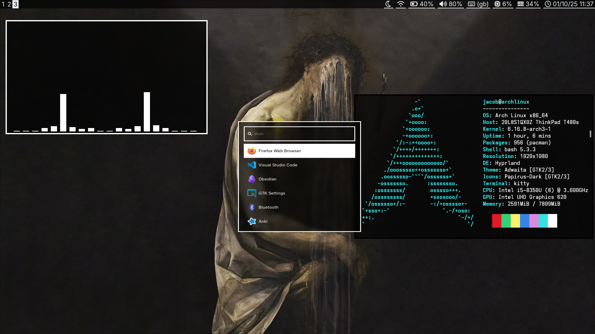

# jwWelburn Hyprland Dotfiles

My personal minimal config for Hyprland on Arch Linux.

# Programs

|   Component   |   Program   |
|---------------|-------------|
|WM             |hyprland     |
|Login Manager  |ly           |
|Terminal       |kitty        |
|Bar            |waybar       |
|File Manager   |ranger       |
|Editor         |neovim/vscode|
|Browser        |firefox      |
|Launcher       |wofi         |
|Notifications  |mako         |
|Music Player   |cmus         |
|Lockscreen     |hyprlock     |
|Wallpaper      |hyprpaper    |
|Night Light    |hyprshift    |
|Audio          |pavucontrol  |
|Theme Manager  |nwg-look     |
|Icons          |papirus-dark |
|Image Viewer   |feh          |
